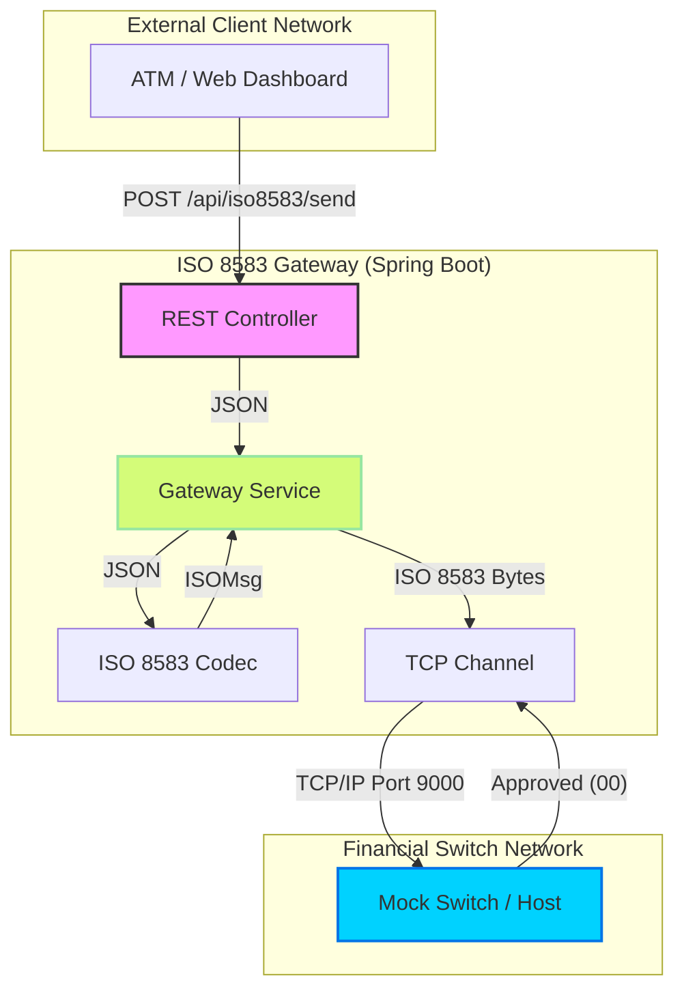
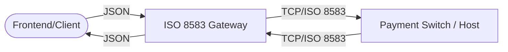

# ATM ISO 8583 Gateway
A high-performance REST API Gateway designed to bridge modern JSON-based applications with legacy financial switches using the **ISO 8583:1987** standard.


## Key Features

* **JSON to ISO 8583 Conversion**: Bi-directional transformation of complex financial messages.
* **Modern REST API**: Exposure of standard banking operations (Auth, Financial, Reversal) via clean endpoints.
* **jPOS Integration**: Leverages the industry-standard jPOS library for robust message packaging.
* **Interactive Simulator**: Includes a built-in Mock Switch for local testing without physical hardware.
* **OpenAPI Documentation**: Integrated Swagger UI for easy API exploration and testing.
* **Glassmorphism Dashboard**: A premium UI to visualize live traffic and gateway status.

---

## System Architecture

The gateway acts as an orchestration layer between your backend and the payment switch.



---

## Tech Stack

* **Backend**: Java 17, Spring Boot 3.2
* **ISO Engine**: [jPOS](http://jpos.org/)
* **API Specs**: OpenAPI 3.0 / Swagger UI
* **Frontend**: Vanilla JS, Glassmorphism CSS
* **Build Tool**: Maven
* **Containerization**: Docker & Docker Compose

---

## Getting Started

### Prerequisites

* JDK 17 or higher
* Maven 3.8+
* Docker (Optional, for containerized deployment)

### Local Development

1. **Clone the repository**:
    ```bash
    git clone https://github.com/your-repo/atm-iso8583-gateway.git
    cd atm-iso8583-gateway
    ```

2. **Build the project**:
    ```bash
    mvn clean install
    ```

3. **Start the Mock Switch** (Terminal 1):
    ```bash
    mvn test-compile exec:java -Dexec.mainClass=com.atm.iso8583.simulator.Iso8583MockSwitch
    ```

4. **Start the Gateway Application** (Terminal 2):
    ```bash
    mvn spring-boot:run
    ```

5. **Access the Dashboard**:
    Open `http://localhost:8080` in your browser.

6. **Explore the API**:
    Open `http://localhost:8080/api/swagger-ui.html`.

---

## Docker Deployment

To run the entire ecosystem (Gateway + Mock Switch) in containers:

```bash
docker-compose up --build
```

The gateway will be available at `http://localhost:8080` and the mock switch will be internal to the docker network.

---

## Documentation

For detailed information, please refer to the following guides:

* [API Guide](docs/api_guide.md) - Endpoint details and JSON payloads.
* [Class Diagram & Architecture](docs/architecture.md) - Deep dive into the internal design.
* [Configuration Guide](docs/configuration.md) - How to customize network settings.
* [Simulation & Testing](docs/mock_switch.md) - Using the mock switch for development.

---

## License

This project is licensed under the MIT License.
