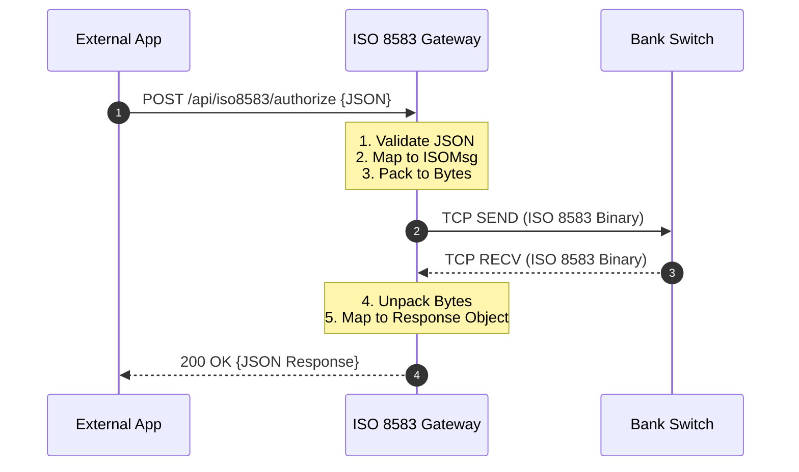

# API Reference Guide

The ISO 8583 Gateway exposes a RESTful interface to perform traditional financial transactions via modern JSON objects.

## Postman

Ready-to-import Postman assets are available in `docs/postman`:

- `docs/postman/ATM_ISO8583.postman_collection.json`
- `docs/postman/ATM_ISO8583.local.postman_environment.json`

## 🔗 Endpoint Summary

| Endpoint | Method | MTI Mode | Description |
| :--- | :--- | :--- | :--- |
| `/api/iso8583/send` | `POST` | Generic | Sends any custom MTI payload. |
| `/api/iso8583/authorize` | `POST` | `0100` | Authorization Request. |
| `/api/iso8583/financial` | `POST` | `0200` | Financial Transaction Request. |
| `/api/iso8583/reversal` | `POST` | `0400` | Reversal Request. |
| `/api/iso8583/echo` | `POST` | `0800` | Network Echo Test (301). |

---

## 🔄 Transaction Flow

The following diagram shows the end-to-end lifecycle of a REST API request as it travels through the gateway:



---

## 🏗 Common Fields

| Field | JSON Property | Type | Description |
| :--- | :--- | :--- | :--- |
| **MTI** | `mti` | `String` | Message Type Indicator (e.g., `0100`). |
| **DE 2** | `pan` | `String` | Primary Account Number (Up to 19 digits). |
| **DE 3** | `processingCode` | `String` | PCode (6 digits, e.g., `000000` for purchase). |
| **DE 4** | `amount` | `String` | Amount in cents (12 digits, zero-padded). |
| **DE 11** | `stan` | `String` | Systems Trace Audit Number (6 digits). |
| **DE 37** | `retrievalReferenceNumber`| `String` | RRN (12 chars). |
| **DE 41** | `terminalId` | `String` | Card Acceptor Terminal ID (8 chars). |
| **DE 49** | `currencyCode` | `String` | Numeric ISO currency code (e.g., `978` for EUR). |

---

## 📦 Examples

### 1. Authorization Request (0100)

**Request Body:**
```json
{
  "mti": "0100",
  "pan": "4111111111111111",
  "processingCode": "000000",
  "amount": "000000010000",
  "transmissionDateTime": "0301020500",
  "stan": "000001",
  "localTime": "020500",
  "localDate": "0301",
  "expirationDate": "2712",
  "merchantCategoryCode": "6011",
  "posEntryMode": "021",
  "posConditionCode": "00",
  "acquiringInstitutionId": "000001",
  "retrievalReferenceNumber": "123456789012",
  "terminalId": "TERM0001",
  "merchantId": "MERCHANT000001 ",
  "cardAcceptorNameLocation": "ATM BRANCH 01       PARIS      FR",
  "currencyCode": "978"
}
```

**Response Body:**
```json
{
  "status": "SUCCESS",
  "mti": "0110",
  "processingCode": "000000",
  "amount": "000000010000",
  "transmissionDateTime": "0301020500",
  "stan": "000001",
  "localTime": "020500",
  "localDate": "0301",
  "retrievalReferenceNumber": "123456789012",
  "authorizationCode": "AUTH01",
  "responseCode": "00",
  "responseDescription": "Approved",
  "terminalId": "TERM0001",
  "merchantId": "MERCHANT000001 ",
  "currencyCode": "978",
  "timestamp": "2026-03-01T04:30:00Z"
}
```

### 2. Network Echo (0800)

**Request Body:**
```json
{
  "mti": "0800",
  "stan": "000000",
  "transmissionDateTime": "0301020500",
  "acquiringInstitutionId": "000001",
  "networkManagementCode": "301"
}
```

---

## 🔴 Error Handling

The gateway returns different HTTP statuses depending on the communication outcome:

*   `200 OK`: Successful communication with the switch (even for "Declined" transactions).
*   `400 Bad Request`: JSON validation errors.
*   `503 Service Unavailable`: Switch is offline or refused connection.
*   `504 Gateway Timeout`: The switch did not respond within the configured timeout.
