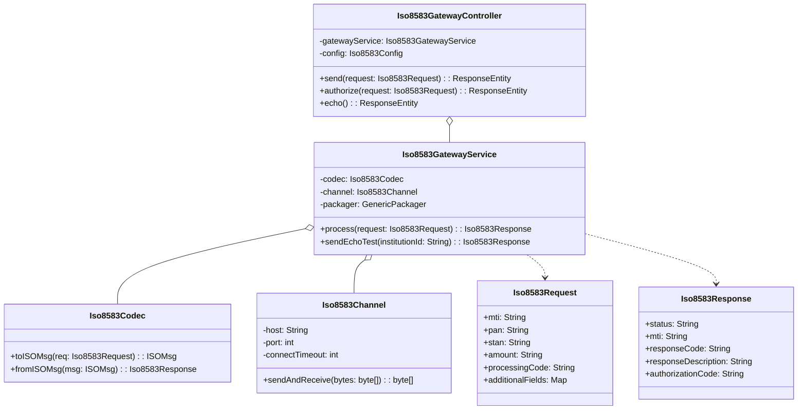
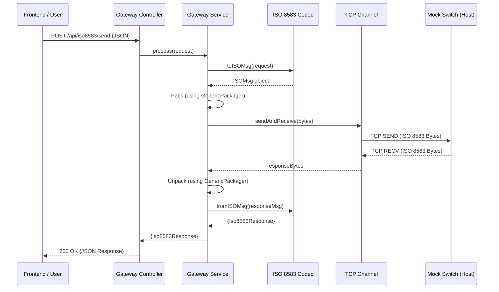

# Architecture & Class Diagram

The ISO 8583 Gateway follows a clean layered architecture, abstracting the complexities of low-level TCP/IP and binary message packaging away from the RESTful API.

## 🧱 Component Overview

The main components are:
*   **Controller**: Exposes RESTful endpoints and handles request body validation.
*   **Service**: Orchestrates the round-trip from JSON to ISO 8583 and back.
*   **Codec**: Converts the JSON model to jPOS `ISOMsg` and vice-versa.
*   **Channel**: Low-level TCP client that communicates with the host (Mock Switch).
*   **jPOS Packager**: Uses XML-based definitions (`custom_iso87.xml`) to format binary messages.

---

## 🧬 Class Diagram

Below is a simplified view of the internal class structure.

---

## 🔄 Sequence Diagram: Request Flow

The following diagram illustrates a full request/response cycle:

---

## 🛠 Data Mapping

Fields are mapped according to the **ISO 8583:1987** specification. The mapping rules are defined in the `Iso8583Codec` class and the `src/main/resources/packager/custom_iso87.xml` file.

Key fields include:
*   **DE 2**: Card Number (Primary Account Number)
*   **DE 4**: Transaction Amount (12-digit, zero-padded)
*   **DE 11**: System Trace Audit Number (STAN)
*   **DE 39**: Response Code (e.g., `00` for Approved, `51` for Insufficient Funds)
