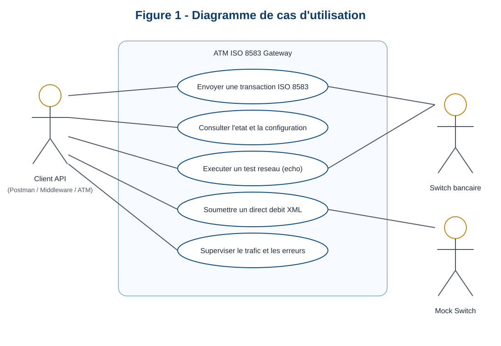
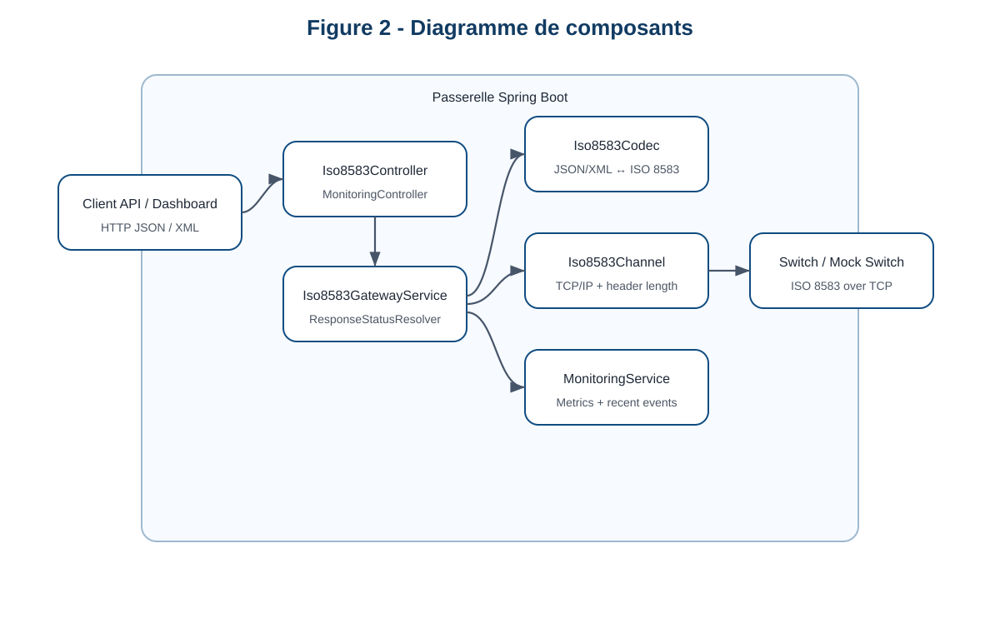
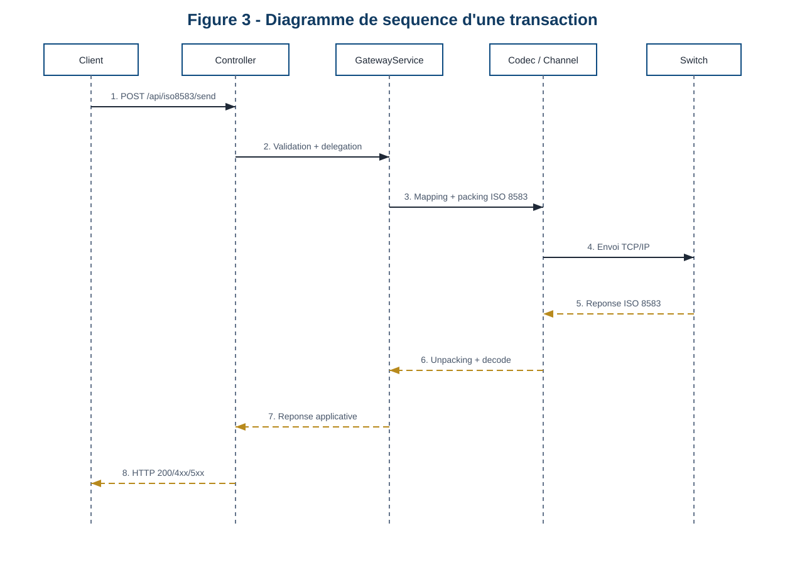
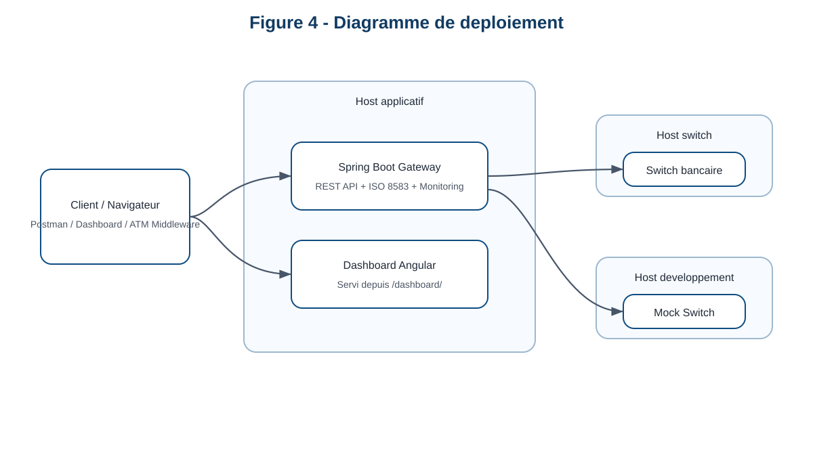

# Rapport De Projet De Fin D'Etudes

## Titre

**Conception et developpement d'une passerelle ISO 8583**

## Etudiant

- Nom : `YASSINE BENAICH`
- Etablissement : `ENSET Mohammedia`
- Filiere : `Big Data and Cloud Computing`
- Entreprise d'accueil : `Hightech Payment Systems`
- Lieu : `Casablanca`
- Periode : du `13 janvier 2026` au `12 juin 2026`
- Encadrant academique : `MOHAMED YOUSSFI`
- Encadrant professionnel : `OTHMAN KHOULFY`

## Remerciements

Je tiens a adresser mes sinceres remerciements a toutes les personnes qui ont contribue a la reussite de ce projet de fin d'etudes. Mes premiers remerciements vont a mon encadrant academique, Monsieur MOHAMED YOUSSFI, pour son accompagnement, ses orientations pertinentes et son suivi durant toute la periode du stage. Je remercie egalement mon encadrant professionnel, Monsieur OTHMAN KHOULFY, pour sa disponibilite, sa confiance et la qualite de ses conseils techniques au sein de Hightech Payment Systems. J'exprime aussi ma gratitude a l'ensemble de l'equipe de l'entreprise pour son accueil, son professionnalisme et le partage de son expertise dans le domaine des systemes de paiement. Enfin, je remercie ma famille et mes proches pour leur soutien moral et leurs encouragements.

## Resume

Ce projet de fin d'etudes, realise au sein de Hightech Payment Systems a Casablanca, porte sur la conception et le developpement d'une passerelle ISO 8583 destinee a assurer l'interconnexion entre des applications modernes et des systemes monetiques historiques. Dans les environnements bancaires, de nombreux equipements et plateformes de paiement communiquent encore a l'aide du protocole ISO 8583, tandis que les nouvelles applications utilisent principalement des API REST basees sur JSON ou XML. L'objectif du projet a ete de developper une solution capable de convertir des requetes HTTP en messages ISO 8583, de les transmettre vers un switch bancaire via TCP/IP, puis de reconvertir les reponses dans des formats exploitables par les clients. La solution implementee repose sur Java 17, Spring Boot 3.2.3, jPOS 2.1.10 et Angular 20. Elle integre egalement un simulateur de switch, une facade XML pour un cas d'usage powerCARD, un module de monitoring temps reel et une documentation Swagger/OpenAPI. Le projet apporte ainsi une reponse concrete a une problematique d'interoperabilite, de supervision et de modernisation des echanges monetiques.

## Abstract

This final-year project, carried out at Hightech Payment Systems in Casablanca, focuses on the design and development of an ISO 8583 gateway intended to bridge modern applications with legacy payment systems. In banking environments, many ATM and payment infrastructures still rely on ISO 8583, while modern software ecosystems mainly use REST APIs with JSON or XML payloads. The main objective of this project was to build a solution able to transform HTTP requests into ISO 8583 messages, send them to a payment switch over TCP/IP, and convert the received responses back into client-friendly formats. The implemented solution is based on Java 17, Spring Boot 3.2.3, jPOS 2.1.10, and Angular 20. It also includes a mock switch for testing, an XML facade for a powerCARD direct debit use case, a real-time monitoring module, and Swagger/OpenAPI documentation. The project provides a practical answer to interoperability, observability, and modernization challenges in payment systems.

## Liste des acronymes

- `ATM` : Automated Teller Machine
- `API` : Application Programming Interface
- `ISO 8583` : norme de messagerie pour les transactions bancaires par carte
- `MTI` : Message Type Indicator
- `DE` : Data Element
- `STAN` : System Trace Audit Number
- `RRN` : Retrieval Reference Number
- `EMV` : Europay MasterCard Visa
- `TCP/IP` : Transmission Control Protocol / Internet Protocol
- `PFE` : Projet de Fin d'Etudes

## Liste des figures

- Figure 1 : Diagramme de cas d'utilisation de la passerelle
- Figure 2 : Diagramme de composants de la solution
- Figure 3 : Diagramme de sequence d'une transaction ISO 8583
- Figure 4 : Diagramme de deploiement de la solution

## Liste des tableaux

- Tableau 1 : Synthese des objectifs du projet
- Tableau 2 : Besoins fonctionnels et non fonctionnels
- Tableau 3 : Stack technologique retenue
- Tableau 4 : Endpoints exposes par la passerelle
- Tableau 5 : Strategie de test et validation

## Introduction generale

Le secteur des paiements electroniques repose sur des infrastructures critiques, robustes et fortement standardisees. Malgre l'evolution rapide des technologies web, une partie importante des echanges bancaires continue de s'appuyer sur la norme ISO 8583, particulierement utilisee dans les transactions ATM, les terminaux de paiement et les switchs monetiques. Ce standard reste tres present dans les architectures legacy, tandis que les applications actuelles consomment principalement des services exposes sous forme d'API REST. Cette difference de paradigme engendre des difficultes d'integration, de test, de maintenance et de supervision.

Dans ce contexte, le present projet de fin d'etudes vise a concevoir une passerelle ISO 8583 permettant de relier ces deux univers technologiques. L'idee est de proposer une interface moderne, documentee et exploitable par des applications web ou des systemes tiers, tout en assurant la compatibilite avec les mecanismes de communication propres aux infrastructures de paiement. Le projet ne se limite pas a la simple conversion de messages. Il inclut egalement la gestion des erreurs, la supervision des transactions, la simulation d'un switch bancaire, l'exposition d'un tableau de bord de monitoring et la preparation au deploiement.

L'interet academique de ce travail reside dans la convergence de plusieurs domaines : le developpement backend, l'integration applicative, les protocoles financiers, le monitoring et le deploiement. L'interet professionnel est tout aussi important, car la solution developpee repond a un besoin concret de simplification des integrations dans un environnement de paiement.

La demarche adoptee durant le stage a ete incrementale. Une premiere phase a consiste a comprendre le protocole ISO 8583 et a etudier les besoins reels de l'entreprise. Une deuxieme phase a porte sur la conception de l'architecture logicielle et le choix des technologies. Une troisieme phase a ete consacree au developpement du gateway, du codec, du canal TCP, de la facade XML et du monitoring. Enfin, une phase de validation et de mise en forme a permis de consolider le resultat final.

Le tableau suivant resume les objectifs majeurs du projet.

| Objectif | Finalite |
|---|---|
| Exposer des APIs modernes | Simplifier l'integration avec des clients REST et XML |
| Convertir les messages | Relier JSON/XML et ISO 8583 |
| Assurer l'echange TCP | Communiquer avec un switch ou un mock switch |
| Superviser l'activite | Mesurer trafic, latence, succes et erreurs |
| Documenter et tester | Faciliter la validation et l'appropriation du systeme |

## Chapitre 1 : Presentation de l'entreprise et contexte du stage

### 1.1 Presentation de Hightech Payment Systems

Hightech Payment Systems evolue dans le domaine des technologies de paiement electronique. Ce type d'entreprise intervient dans un environnement critique ou la disponibilite des services, la fiabilite des transactions et la compatibilite avec les normes monetiques sont essentielles. Le stage s'inscrit dans cette dynamique de modernisation des plateformes et des interfaces d'integration.

L'interet de realiser un PFE dans cet environnement est particulierement important. Il permet de travailler sur des problemes reels, lies a l'interconnexion entre applications modernes, switchs de paiement, canaux de communication et outils de supervision. Le sujet retenu offre donc un cadre a la fois academique et professionnel, avec une forte valeur pratique.

### 1.2 Secteur d'activite et environnement de paiement

Le secteur des paiements se caracterise par une forte contrainte de disponibilite, une exigence de securite elevee et une necessite permanente de compatibilite entre systemes heterogenes. Les banques, les switchs, les terminaux et les ATM doivent echanger des informations de facon fiable, standardisee et auditable.

Dans cet environnement, ISO 8583 occupe une place centrale. Il sert de langage commun pour representer les transactions par carte, les messages de gestion reseau et plusieurs flux monetiques. Cependant, les applications recentes n'interagissent plus directement avec ce standard et preferent des API web plus simples a consommer.

### 1.3 Contexte general du stage

Le stage s'est deroule a Casablanca du 13 janvier 2026 au 12 juin 2026. Le besoin exprime au depart etait de mettre en place une passerelle applicative capable d'exposer des services modernes tout en restant compatible avec un ecosyteme de paiement heritage. L'enjeu etait donc de construire une solution intermediaire robuste, lisible et exploitable.

Le projet a aussi ete pense comme un socle de demonstration et de validation. Il ne s'agissait pas uniquement d'envoyer des messages ISO 8583, mais egalement de fournir une documentation, des tests, une simulation locale et un dashboard de supervision.

### 1.4 Problematique metier

La problematique metier centrale peut etre resumee de la maniere suivante : comment permettre a des clients applicatifs modernes de consommer facilement des operations monetiques alors que les switchs bancaires utilisent encore un protocole bas niveau comme ISO 8583 sur TCP/IP ?

Sans passerelle dediee, chaque client devrait connaitre le format des messages, les champs obligatoires, les regles de packing, la gestion du header reseau et l'interpretation des reponses. Une telle approche est couteuse, peu maintenable et source d'erreurs. La passerelle devient donc un composant de simplification et de securisation des integrations.

### 1.5 Cahier de mission

La mission confiee durant le stage peut etre sintetisee autour des axes suivants :

- analyser les contraintes techniques du protocole ISO 8583,
- concevoir une architecture logicielle modulaire,
- developper une API REST capable d'interfacer un switch ISO 8583,
- ajouter une facade XML orientee metier,
- mettre en place un systeme de monitoring temps reel,
- fournir un mock switch pour les tests locaux,
- documenter et preparer le deploiement de la solution.

### 1.6 Methodologie de travail adoptee

La methodologie adoptee a ete iterative. Une premiere etape a consiste a etudier le besoin et le protocole. Une deuxieme etape a porte sur la conception de l'architecture et le choix des composants. Une troisieme etape a ete consacree a l'implementation progressive du gateway, du monitoring, du simulateur et de la facade metier. Enfin, une etape de test et de formalisation a permis de consolider le projet.

Cette approche a permis de valider rapidement les fondations techniques, puis d'enrichir la solution par couches successives sans perdre la coherence d'ensemble.

### 1.7 Conclusion

Ce premier chapitre a permis de situer le stage dans son contexte institutionnel et technique. Il montre que le projet repond a une problematique reelle d'interoperabilite entre applications modernes et infrastructures monetiques. Le chapitre suivant detaille l'existant, les limites observees et les besoins qui ont conduit a la conception de la passerelle.

## Chapitre 2 : Problematique et expression des besoins

### 2.1 Introduction

Avant de construire la solution, il etait necessaire de comprendre l'environnement existant, ses contraintes et les besoins reels du projet. Ce travail d'analyse a permis d'eviter une approche purement technique deconnectee des usages attendus.

### 2.2 Presentation du protocole ISO 8583

ISO 8583 est un standard de messagerie utilise dans les transactions financieres par carte. Il organise l'information sous forme de message type indicator, de bitmap et de data elements. Chaque data element transporte une information metier precise, comme le numero de carte, le montant, le code traitement, le terminal d'origine, la devise ou le code retour.

La norme est particulierement adaptee aux infrastructures monetiques, car elle offre un cadre stable, compact et largement reconnu. En revanche, elle reste difficile a manipuler directement depuis des applications qui privilegient des structures de donnees plus lisibles comme JSON ou XML.

### 2.3 Fonctionnement des echanges monetiques ATM

Dans un flux ATM classique, une application ou un equipement collecte les informations de transaction, construit un message ISO 8583 puis l'envoie a un switch via TCP/IP. Le switch traite la demande, consulte si necessaire d'autres systemes metier, puis renvoie une reponse ISO 8583 contenant un code resultat. L'equipement ou l'application appelante doit alors interpreter ce code et agir en consequence.

Ce mode de fonctionnement est fiable mais il expose les clients a une forte complexite technique. Toute erreur dans le formatage du message, la gestion du canal ou la lecture de la reponse peut compromettre le traitement.

### 2.4 Analyse de l'existant

L'analyse de l'existant montre que les systemes traditionnels reposent sur des interactions bas niveau qui ne sont pas directement exploitables par des clients applicatifs modernes. Les echanges sont souvent realises via socket TCP, avec une gestion explicite des en-tetes de longueur, du framing reseau et des structures ISO 8583.

Du cote des applications modernes, les attentes sont differentes : API documentees, formats structurés, messages lisibles, erreurs comprehensibles et mecanismes de supervision. Il existe donc un ecart important entre les usages attendus cote client et la realite technique du protocole.

### 2.5 Limites de l'approche traditionnelle

Les limites principales de l'approche traditionnelle sont les suivantes :

- forte dependance des clients a la structure ISO 8583,
- complexite des tests en l'absence de switch accessible,
- faible lisibilite des erreurs et des retours,
- difficulte de supervision des temps de reponse et des incidents,
- faible reutilisabilite des integrations.

### 2.6 Besoins fonctionnels

Le projet devait donc couvrir les besoins fonctionnels suivants :

- envoyer des messages ISO 8583 generiques,
- proposer des endpoints dedies a l'autorisation, au financier, au presentment, au reversal et a l'echo test,
- exposer une facade XML pour un direct debit powerCARD,
- offrir des endpoints de sante, de statut et de configuration,
- suivre les transactions via un module de monitoring,
- permettre des tests locaux avec un mock switch.

### 2.7 Besoins non fonctionnels

Les besoins non fonctionnels identifies sont :

- maintenabilite de l'architecture,
- performance acceptable du gateway,
- tracabilite des requetes,
- observabilite des erreurs et des latences,
- documentation des interfaces,
- simplicite de deploiement.

### 2.8 Contraintes techniques

Les principales contraintes techniques sont liees a :

- la conformite au standard ISO 8583:1987,
- l'echange via TCP/IP avec header de longueur,
- la gestion de champs binaires et hexadecimaux,
- la compatibilite avec un format XML metier specifique,
- l'absence de switch de production pendant le developpement.

Le tableau ci-dessous resume les attentes fonctionnelles et non fonctionnelles.

| Type de besoin | Contenu |
|---|---|
| Fonctionnel | Envoi ISO 8583, echo, direct debit XML, monitoring, documentation |
| Non fonctionnel | Fiabilite, lisibilite, testabilite, observabilite, deployabilite |

### 2.9 Conclusion

L'etude de l'existant a confirme la necessite de disposer d'une couche intermediaire entre les clients modernes et les systemes monetiques. Cette couche devait prendre la forme d'une passerelle capable d'encapsuler la complexite du protocole tout en exposant des interfaces simples a consommer. Le chapitre suivant presente la conception retenue pour repondre a ce besoin.

## Chapitre 3 : Analyse et conception de la solution

### 3.1 Introduction

La phase de conception avait pour objectif de transformer les besoins identifies en une architecture claire, evolutive et suffisamment rigoureuse pour un contexte de paiement. Le choix n'etait pas seulement technologique : il devait aussi favoriser la maintenabilite, la lisibilite et la capacite de test.

### 3.2 Objectifs de la passerelle

La passerelle devait atteindre plusieurs objectifs complementaires :

- masquer la complexite du protocole ISO 8583,
- fournir une interface HTTP simple a consommer,
- garantir la communication avec un hote TCP,
- rendre les echanges observables via un monitoring integre,
- rester extensible vers d'autres flux ou d'autres formats metier.

### 3.3 Architecture generale proposee

L'architecture retenue repose sur une approche en couches afin de separer clairement les responsabilites. La couche controleur expose les endpoints REST et XML. La couche service orchestre la logique metier de traitement. La couche codec est chargee de convertir les objets applicatifs en messages ISO 8583 et inversement. La couche reseau gere le transport TCP/IP avec en-tete de longueur configurable. Enfin, un module transverse de monitoring collecte les metriques et les evenements.



*Figure 1 - Diagramme de cas d'utilisation de la passerelle ISO 8583*

### 3.4 Choix technologiques

Les choix technologiques ont ete faits en fonction de la nature du projet :

| Composant | Choix | Motivation |
|---|---|---|
| Backend | Java 17 | Stabilité, ecosysteme mature, compatibilite entreprise |
| Framework | Spring Boot 3.2.3 | Rapidite de developpement et structuration web |
| ISO engine | jPOS 2.1.10 | Manipulation fiable des messages ISO 8583 |
| Frontend | Angular 20 | Dashboard reactif et structure |
| Documentation | Springdoc OpenAPI | Documentation automatique des endpoints |
| Deploiement | Docker / Compose | Reproductibilite et isolation |

### 3.5 Description des composants principaux

Les composants majeurs de la solution sont les suivants :

- `Iso8583Controller` : expose les operations ISO 8583 cote HTTP,
- `Iso8583GatewayService` : coordonne le traitement d'une transaction,
- `Iso8583Codec` : transforme les modeles applicatifs en `ISOMsg`,
- `Iso8583Channel` : dialogue avec le switch via TCP/IP,
- `MonitoringService` : collecte les metriques et les evenements,
- `PowerCardDirectDebitController` : traite le cas XML powerCARD,
- `Iso8583MockSwitch` : simule un switch bancaire pour les tests.



*Figure 2 - Diagramme de composants de la solution*

### 3.6 Diagramme de cas d'utilisation

Le diagramme de cas d'utilisation montre les interactions principales entre les acteurs et la passerelle. Le client applicatif peut envoyer des transactions, consulter la configuration, lancer un echo test et superviser le comportement du systeme. Un switch bancaire ou un mock switch intervient comme acteur externe pour traiter les echanges ISO 8583. Cette vue fonctionnelle permet de situer le role exact de la passerelle dans l'ecosysteme du projet.

### 3.7 Diagramme de composants

Le diagramme de composants met en evidence la decomposition logicielle de la passerelle. Il montre le cheminement logique entre les controleurs, le service central, le codec, le canal reseau et le monitoring. Cette representation est utile pour justifier la separation des responsabilites et la modularite de la solution.

### 3.8 Diagramme de sequence

Le diagramme de sequence detaille le deroulement d'une transaction. Il montre comment la requete est recue par le controleur, deleguee au service, convertie par le codec, envoyee via le canal reseau puis retournee au client sous forme d'une reponse applicative interpretable.



*Figure 3 - Diagramme de sequence d'une transaction ISO 8583*

### 3.9 Modelisation des donnees ISO 8583

Le modele de donnees a ete pense pour simplifier l'usage cote client. La classe `Iso8583Request` expose les principaux champs nommes comme `mti`, `pan`, `processingCode`, `amount`, `stan`, `terminalId`, `merchantId`, `currencyCode`, ainsi que deux mecanismes generiques pour gerer des champs additionnels. La classe `Iso8583Response` remonte les informations essentielles comme le MTI de reponse, le code `DE39`, la description fonctionnelle, le statut, les champs importants et le temps de traitement.

La passerelle supporte explicitement plusieurs data elements essentiels du standard :

| Champ applicatif | Data Element ISO 8583 |
|---|---|
| `pan` | `DE2` |
| `processingCode` | `DE3` |
| `amount` | `DE4` |
| `transmissionDateTime` | `DE7` |
| `stan` | `DE11` |
| `retrievalReferenceNumber` | `DE37` |
| `terminalId` | `DE41` |
| `merchantId` | `DE42` |
| `currencyCode` | `DE49` |
| `networkManagementCode` | `DE70` |

### 3.10 Conclusion

La conception retenue repond aux objectifs de modularite, de lisibilite et d'evolutivite fixes au depart. Les diagrammes produits permettent de visualiser les interactions, la decomposition des composants et le flux de traitement. Le chapitre suivant presente la mise en oeuvre technique de cette architecture.

## Chapitre 4 : Realisation technique

### 4.1 Introduction

La phase de realisation a transforme les choix de conception en composants concrets, deployables et testables. Elle couvre le backend Spring Boot, l'integration jPOS, le canal reseau, la facade XML, le monitoring, le dashboard et les outils de support comme le mock switch.

### 4.2 Mise en place du projet backend

Le projet backend a ete initialise autour de Spring Boot 3.2.3 avec Java 17 et Maven. Cette base a permis d'organiser clairement la configuration, les dependances, les modeles, les services, les controleurs et la gestion des exceptions. La configuration applicative centralise les parametres reseau du switch, les timeouts, le port HTTP et les proprietes de logging.

### 4.3 Developpement du controleur REST

Le controleur principal expose les routes `/api/iso8583/send`, `/authorize`, `/financial`, `/presentment`, `/reversal`, `/echo`, `/config`, `/health` et `/status`. Les endpoints de raccourci imposent automatiquement le MTI adapte au type d'operation. L'endpoint `echo` genere un message `0800` avec le code de gestion reseau `301` afin de verifier la connectivite avec le switch.

Le tableau suivant resume les principales routes du projet.

| Endpoint | Role |
|---|---|
| `/api/iso8583/send` | Envoi libre d'un message ISO 8583 |
| `/api/iso8583/authorize` | Autorisation `0100` |
| `/api/iso8583/financial` | Transaction financiere `0200` |
| `/api/iso8583/presentment` | Presentment `1200` |
| `/api/iso8583/reversal` | Reversal `0400` |
| `/api/iso8583/echo` | Test reseau `0800` |
| `/api/powercard/direct-debit` | Facade XML metier |
| `/api/monitoring/*` | Exposition des metriques et evenements |

### 4.4 Developpement du service de traitement ISO 8583

Le service `Iso8583GatewayService` orchestre l'ensemble du cycle de traitement. Il initialise le packager ISO, appelle le codec, realise le packing, echange les donnees avec le switch, puis unpacke la reponse et construit l'objet final. Ce service mesure egalement la duree de traitement et alimente le service de monitoring avec les informations de latence, de statut et de code reponse.

### 4.5 Implementation du codec JSON/XML vers ISO 8583

Le composant `Iso8583Codec` effectue le mapping entre les proprietes metier et les data elements ISO 8583. Par exemple, le `pan` correspond au `DE2`, le `processingCode` au `DE3`, le `amount` au `DE4`, le `transmissionDateTime` au `DE7`, le `stan` au `DE11`, le `retrievalReferenceNumber` au `DE37`, le `terminalId` au `DE41` et le `currencyCode` au `DE49`. Les donnees PIN et EMV sont traitees en hexadecimal puis converties en binaire si necessaire.

### 4.6 Implementation du canal TCP/IP

La communication avec le switch est assuree par `Iso8583Channel`. Cette classe etablit un socket TCP vers l'hote configure, ecrit un en-tete de longueur puis le payload ISO 8583. Elle lit ensuite la reponse en respectant le meme mecanisme de framing. Les timeouts de connexion et de lecture sont configurables, ce qui ameliore l'adaptabilite du systeme.

### 4.7 Integration de jPOS et du packager personnalise

Le choix de jPOS permet d'eviter une implementation artisanale du protocole. Le fichier de packager personnalise decrit les champs ISO 8583 attendus, leurs longueurs et leurs formats. Cette approche facilite la maintenance du systeme et reduit le risque d'erreurs de packing ou d'unpacking.

### 4.8 Developpement de la facade XML powerCARD

Une facade XML a ete developpee via `PowerCardDirectDebitController` pour repondre a un cas d'usage specifique. Elle recoit un objet `DirectDebitTransferRequest`, le convertit en requete ISO `1200` a l'aide de `PowerCardDirectDebitMapper`, puis transforme la reponse obtenue en `DirectDebitTransferResponse`. Les comptes source et destination sont mappes respectivement vers `DE102` et `DE103`, tandis que le narratif est injecte dans `DE48`.

### 4.9 Gestion des exceptions et des statuts HTTP

La solution normalise les erreurs applicatives et reseau via un handler global. Les erreurs de validation, les erreurs de contrainte, les exceptions generiques et les ressources introuvables sont converties en structures de reponse homogenes. En complement, les codes ISO 8583 sont traduits vers des statuts HTTP adaptes afin de simplifier l'exploitation cote client.

### 4.10 Journalisation et tracabilite

Un intercepteur HTTP ajoute et propage le header `X-Request-ID`. Cela permet de tracer chaque requete de bout en bout dans les journaux applicatifs. Cette decision est importante dans un contexte de paiement, car elle facilite le diagnostic et la correlation entre appels entrants, transactions reseau et evenements de supervision.

### 4.11 Developpement du module de monitoring

Le projet integre un module de supervision. `MonitoringService` enregistre les transactions traitees, calcule le volume total, le taux de succes, le nombre de refus, le nombre d'erreurs, la latence moyenne, le percentile P95, les valeurs minimales et maximales, ainsi que la frequence de transactions sur la derniere minute. Ces informations sont exposees via `MonitoringController` sous les routes `/api/monitoring/metrics`, `/events` et `/errors`.

### 4.12 Developpement du dashboard Angular

Pour la partie interface, un dashboard Angular 20 a ete developpe et embarque dans l'application backend. Accessible via `/dashboard/`, il interroge les endpoints de monitoring toutes les quatre secondes. Il affiche les indicateurs cles sous forme de cartes, de barres de latence, de repartitions par statut et de tableaux d'evenements recents.

### 4.13 Conclusion

La phase de realisation a abouti a une solution complete, couvrant le backend, la conversion ISO 8583, la communication reseau, la facade metier, la journalisation, le monitoring et le dashboard. Le diagramme de deploiement suivant resume la maniere dont ces composants sont organises en execution.



*Figure 4 - Diagramme de deploiement de la solution*

## Chapitre 5 : Tests, validation et deploiement

### 5.1 Introduction

La valeur d'un gateway de paiement ne repose pas uniquement sur sa conception. Elle depend aussi de sa validation, de sa testabilite et de sa capacite a etre deploye dans un environnement stable. C'est pourquoi le projet a ete accompagne d'une strategie de test et d'un dispositif de deploiement simple a reproduire.

### 5.2 Strategie de test

La strategie retenue combine des tests unitaires, des tests d'integration et des validations manuelles. L'objectif est de verifier a la fois le comportement isole des composants critiques et la coherence globale du systeme lorsqu'il traite une transaction complete.

### 5.3 Tests unitaires

Le depot contient des tests pour le codec, le monitoring, l'intercepteur de journalisation et certains comportements du controleur. Ces tests permettent de valider le mapping des champs, la construction des reponses, la propagation du `X-Request-ID` et le calcul des metriques.

### 5.4 Tests d'integration

Les tests d'integration verifient la disponibilite des endpoints, les validations de payload, les erreurs de saisie et la facade XML powerCARD. Ils sont utiles pour confirmer que les differentes couches du systeme cooperent correctement.

### 5.5 Validation fonctionnelle

La validation fonctionnelle s'appuie sur Swagger, sur une collection Postman et sur le dashboard de monitoring. Elle permet de confirmer que les principales routes attendues sont accessibles et que le comportement global de la solution est conforme au besoin.

Le tableau ci-dessous resume la strategie retenue.

| Type de validation | Objectif |
|---|---|
| Tests unitaires | Verifier le comportement des composants isoles |
| Tests d'integration | Verifier la cooperation entre les couches |
| Validation manuelle | Confirmer les flux via Swagger, Postman et dashboard |

### 5.6 Utilisation du mock switch

Le simulateur `Iso8583MockSwitch` joue un role majeur dans la validation locale. Il permet de simuler le comportement du switch, de renvoyer des reponses ISO 8583 et de tester la chaine complete sans dependre d'un environnement bancaire reel. Cette approche reduit la dependance externe et accelere les cycles de verification.

### 5.7 Documentation Swagger et collection Postman

La solution est documentee via Swagger/OpenAPI. Une collection Postman complete le dispositif en proposant plusieurs scenarios de test preconfigures. Cela rend l'appropriation du projet plus rapide et facilite la demonstration.

### 5.8 Conteneurisation avec Docker

Sur le plan du deploiement, un `Dockerfile` multi-stage permet de construire puis d'executer l'application sous Temurin 17. Un fichier `docker-compose.yml` orchestre le lancement du gateway et du mock switch dans deux conteneurs distincts. Cette configuration facilite la reproductibilite des environnements et prepare la solution a une integration plus industrialisee.

### 5.9 Limites observees

Malgre les resultats obtenus, certaines limites demeurent :

- le monitoring reste en memoire,
- le canal TCP est synchrone,
- la securisation des APIs n'est pas encore mise en place,
- la validation de certains champs peut etre percue comme rigide,
- le compose doit etre verifie si l'on souhaite exposer le mock switch vers l'exterieur.

### 5.10 Conclusion

La phase de test et de validation confirme que la solution remplit ses objectifs principaux : conversion, transport, supervision, simulation et documentation. Le deploiement conteneurise renforce encore la valeur du projet en le rendant plus simple a reproduire et a presenter.

## Chapitre 6 : Bilan et perspectives

### 6.1 Bilan technique

Le projet aboutit a une passerelle complete, documentee et testable. Les objectifs initiaux de conversion, de transport, de supervision et de simulation ont ete atteints. Le resultat final constitue une base solide pour des integrations monetiques modernes autour d'un protocole historiquement complexe.

### 6.2 Competences acquises

Ce travail m'a permis de consolider mes competences en :

- developpement backend avec Spring Boot,
- manipulation de protocoles financiers,
- integration d'une bibliotheque specialisee comme jPOS,
- communication TCP/IP,
- mise en place de monitoring applicatif,
- deploiement via Docker,
- structuration d'une architecture logicielle modulaire.

### 6.3 Difficultes rencontrees

Les principales difficultes rencontrees ont concerne :

- la comprehension du format ISO 8583 et de ses data elements,
- la gestion correcte du framing reseau,
- l'interpretation des codes de reponse,
- la necessite de tester sans infrastructure bancaire reelle,
- la mise en place d'un rendu de supervision lisible et utile.

### 6.4 Solutions apportees

Pour depasser ces difficultes, plusieurs solutions ont ete retenues :

- utilisation de jPOS pour fiabiliser le mapping et le packing,
- creation d'un mock switch pour les validations locales,
- mise en place d'un monitoring centre sur la latence et les erreurs,
- structuration claire du projet en couches distinctes.

### 6.5 Limites du systeme actuel

Le projet presente toutefois certaines limites. Le monitoring est actuellement stocke uniquement en memoire, ce qui ne permet pas la persistance des evenements ni l'analyse historique avancee. Le canal reseau est synchrone et ouvre un socket pour chaque echange, ce qui simplifie l'implementation mais peut limiter les performances a plus grande echelle. Les mecanismes de securite, tels que l'authentification, l'autorisation et le controle de debit, ne sont pas encore integres.

### 6.6 Perspectives d'amelioration

Parmi les perspectives d'amelioration, il serait pertinent d'ajouter un stockage persistant des evenements de monitoring, une exportation vers Prometheus ou Grafana, des mecanismes de resilience comme un circuit breaker, une meilleure securisation des endpoints, ainsi qu'une optimisation du canal TCP a travers du pooling ou des connexions persistantes. Une integration avec un switch bancaire reel en environnement de preproduction constituerait egalement une etape importante pour faire evoluer cette solution vers un usage plus industriel.

### 6.7 Conclusion

Ce bilan montre que le projet a une valeur immediate pour la comprehension et la modernisation des echanges monetiques. Il met egalement en evidence des perspectives credibles d'industrialisation et d'amelioration progressive.

## Conclusion generale

Le projet realise au sein de Hightech Payment Systems a permis de concevoir et developper une passerelle ISO 8583 complete, capable de relier des applications modernes a des systemes monetiques historiques. La solution obtenue assure la conversion des messages, la communication reseau avec un switch, la gestion des reponses, la supervision du trafic et la simulation d'un hote bancaire. Elle demontre qu'il est possible de moderniser l'acces aux services de paiement sans remettre en cause l'existant, en s'appuyant sur une architecture claire, modulaire et documentee.

Ce stage a constitue une experience tres enrichissante sur les plans technique, methodologique et metier. Il m'a permis d'appliquer mes connaissances en developpement logiciel, en integration applicative et en architecture de systemes dans un domaine exigeant et concret. Ce projet represente ainsi une contribution utile a la modernisation des echanges monetiques, tout en constituant une etape importante dans mon parcours academique et professionnel.

## Bibliographie

- Documentation officielle Spring Boot 3.2.x
- Documentation officielle jPOS
- Documentation officielle Angular 20
- Documentation Springdoc OpenAPI
- Documentation Docker et Docker Compose
- Standard ISO 8583:1987
- Ressources techniques internes liees aux systemes de paiement et aux switchs monetiques

## Annexes

### Annexe A : Exemples de routes principales

- `/api/iso8583/send`
- `/api/iso8583/authorize`
- `/api/iso8583/financial`
- `/api/iso8583/reversal`
- `/api/iso8583/echo`
- `/api/powercard/direct-debit`
- `/api/monitoring/metrics`

### Annexe B : Exemple de requete JSON

```json
{
  "mti": "0200",
  "transactionRef": "ATM-20260327-0001",
  "fields": {
    "2": "4111111111111111",
    "3": "000000",
    "4": "000000010000",
    "7": "0327120000",
    "11": "123456",
    "41": "ATM00001",
    "49": "504"
  }
}
```

### Annexe C : Exemple de requete XML powerCARD

```xml
<DirectDebitTransferRequest>
  <transactionRef>DDR-0001</transactionRef>
  <processingCode>400000</processingCode>
  <amount>000000010000</amount>
  <currencyCode>978</currencyCode>
  <sourceAccount>SRC000123</sourceAccount>
  <destinationAccount>DST000456</destinationAccount>
  <narrative>Payroll transfer</narrative>
</DirectDebitTransferRequest>
```
