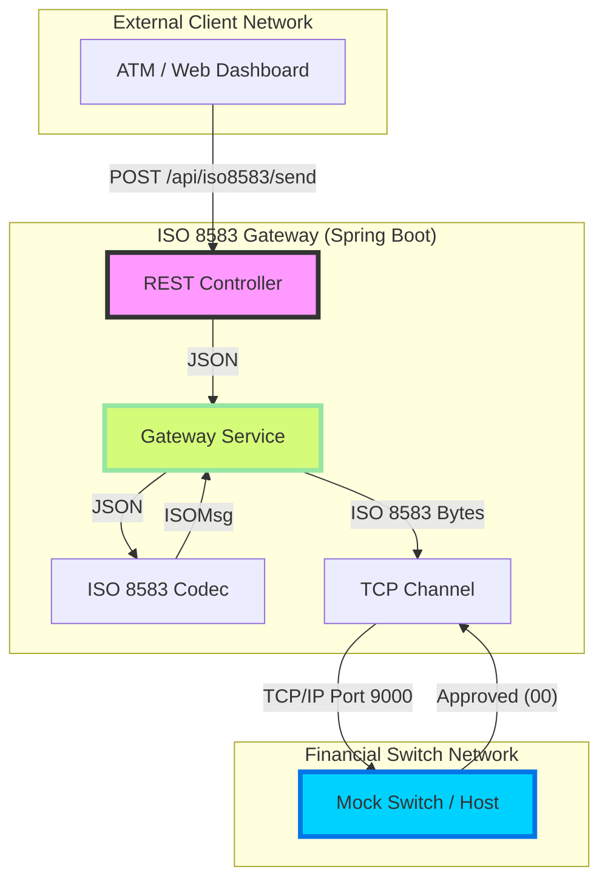

# High-Level Architecture Visualization

The following diagram illustrates the interaction between the Gateway and the External Host (Mock Switch).

## Security Layer (Conceptual)

While not implemented in this demo, a production gateway should include:

*   **HSM (Hardware Security Module)**: For DE 52 (PIN) encryption/decryption.
*   **SSL/TLS**: For the REST API endpoints.
*   **VPN / Leased Line**: For the connection from Gateway to Switch.
*   **MAC (Message Authentication Code)**: For message integrity (DE 64/128).
