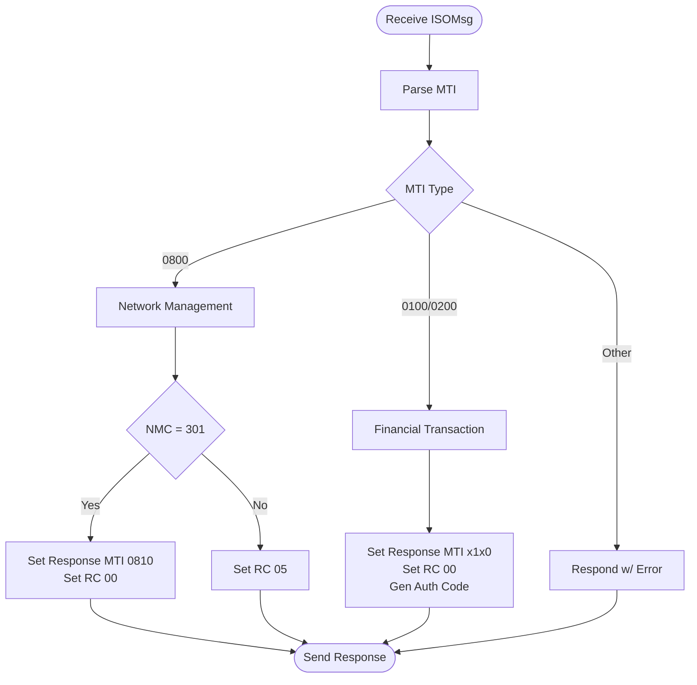

# Simulation & Testing

The ISO 8583 Gateway project includes a built-in **Mock Switch** to simulate a real-world financial transaction host.

## Mock Switch Overview

The Mock Switch is a simple TCP server that listens for ISO 8583 messages and responds based on the MTI and processing code.

### Features
*   **0800 (Network management)**: Echoes back the STAN and NMC 301.
*   **0100 (Authorization)**: Approves any transaction (Response Code 00).
*   **0200 (Financial)**: Approves any financial transaction (Response Code 00).
*   **MTI Header Handling**: Automatically adds the 4-byte length header required by some legacy systems.

### Processing Logic

The Mock Switch evaluates incoming messages using the following decision flow:



---

## How to Run the Mock Switch

You can start the Mock Switch independently using Maven:

```bash
mvn test-compile exec:java -Dexec.mainClass=com.atm.iso8583.simulator.Iso8583MockSwitch
```

Alternatively, you can use the included PowerShell script for Windows:

```powershell
.\run-mock-switch.ps1
```

By default, the switch listens on **Port 9000**.

---

## 🧪 Testing Scenarios

Once both the **Gateway Application** and the **Mock Switch** are running, you can perform the following tests using the Gateway Dashboard (`http://localhost:8080/index.html`) or Swagger UI:

### 1. Simple Connectivity Test (Echo)
*   **Endpoint**: `POST /api/iso8583/echo`
*   **Expected Description**: "Approved" (Response Code 00).

### 2. Basic Authorization
*   **Endpoint**: `POST /api/iso8583/authorize`
*   **JSON Payload**:
    ```json
    {
      "mti": "0100",
      "pan": "4111111111111111",
      "processingCode": "000000",
      "amount": "000000010000",
      "stan": "000001",
      "terminalId": "TERM0001"
    }
    ```
*   **Expected MTI**: `0110`
*   **Expected Auth Code**: `AUTH01`

---

## Customizing the Mock Switch

The logic for handling messages is located in:
`src/test/java/com/atm/iso8583/simulator/Iso8583MockSwitch.java`

You can modify the `handleClient` method to simulate different response codes based on the amount or card number (e.g., return `51` for insufficient funds if the amount exceeds 50000).
